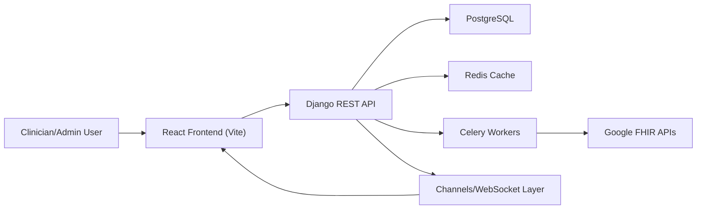

# HMS Codebase Deep Dive

This document is a high-depth technical map of the current HMS codebase.

It is intentionally code-anchored and references the actual implementation in:

- `/Users/jebre/Desktop/hms/backend`
- `/Users/jebre/Desktop/hms/frontend`

For deeper component details, read:

- `/Users/jebre/Desktop/hms/backend/CODEBASE_BACKEND.md`
- `/Users/jebre/Desktop/hms/frontend/CODEBASE_FRONTEND.md`

## 1. System Snapshot

HMS is a workflow-oriented hospital platform composed of:

- Backend: Django + DRF + Channels + Celery (`/backend`)
- Frontend: React + Vite + React Router + TanStack Query (`/frontend`)
- Database: PostgreSQL
- Queue/cache/broker: Redis
- Realtime: WebSockets via Django Channels
- External clinical integration: Google Cloud Healthcare FHIR APIs

## 2. Architecture (End-to-End)

## 3. Monorepo Layout

- `/Users/jebre/Desktop/hms/backend`: API, domain apps, workers, websocket server.
- `/Users/jebre/Desktop/hms/frontend`: UI app with feature modules and route metadata.
- `/Users/jebre/Desktop/hms/tests`: shared and load testing assets.
- `/Users/jebre/Desktop/hms/docker`, `/Users/jebre/Desktop/hms/k8s`: infra manifests.
- `/Users/jebre/Desktop/hms/.github/workflows/ci.yml`: CI pipeline.

## 4. Core Domain Surfaces

Backend domain apps (installed and active) include:

- `users`, `core`, `patients`, `encounters`, `clinical_notes`, `nursing`, `laboratory`, `pharmacy`, `referrals`
- `appointments`, `wards`, `organization`, `workflows`, `dashboards`, `notifications`
- `billing`, `inventory`, `drug_safety`, `audit`, `interop`, `consent`, `mpi`

Frontend route feature modules include 21 feature route groups, consolidated in:

- `/Users/jebre/Desktop/hms/frontend/src/app/routes/featureRoutes.js`

## 5. Primary Clinical Workflows Across Layers

1. Patient chronology
- Frontend route: `/patients/:id`
- Backend surfaces: `patients`, `encounters`, `clinical_notes`, `nursing`, `laboratory`

2. Outpatient/inpatient encounter workflow
- Frontend routes: `/encounters/*`, `/workflows/*`, dashboard routes
- Backend surfaces: `encounters`, `workflows`, `dashboards`, `organization`

3. Nursing operations
- Frontend routes: `/nursing/*`
- Backend surfaces: `nursing` (vitals/tasks/alerts/MAR/fluid balance), `notifications`

4. Lab order-to-result lifecycle
- Frontend routes: `/laboratory/*`
- Backend surfaces: `laboratory` (orders/specimens/results), `notifications`

5. Revenue cycle and claims
- Frontend routes: `/billing/*`
- Backend surfaces: `billing` (invoices/payments/claims/PSP/NHIS)

## 6. Security and Scope Model (High Level)

- JWT access token + refresh cookie authentication.
- Request-level facility context enforced from header/token/default.
- Queryset/object level access controls centralized in `apps/core/security.py`.
- Offsite read-only mode can block write operations.
- Role-gated frontend routes plus backend authorization checks.

## 7. Realtime Model (High Level)

WebSocket channels are used for:

- nursing alerts
- patient vital stream
- referral notifications
- dashboard invalidation streams

Backend routes are defined in:

- `/Users/jebre/Desktop/hms/backend/hms_backend/routing.py`

Frontend websocket client is implemented in:

- `/Users/jebre/Desktop/hms/frontend/src/lib/websocket.js`

## 8. Async/Background Model (High Level)

Celery is used for:

- external integration syncs (FHIR and other async work)
- notification fanout
- dashboard cache refresh
- cleanup and maintenance tasks

Worker schedule is configured in:

- `/Users/jebre/Desktop/hms/backend/hms_backend/settings.py`

## 9. Testing and CI

- Backend: `pytest` with DB reuse and tier markers (`/backend/pytest.ini`).
- Frontend: Vitest + ESLint + build checks.
- CI: backend tests, frontend tests, and docker build parity in one pipeline.

Reference:

- `/Users/jebre/Desktop/hms/.github/workflows/ci.yml`

## 10. Known Current-State Characteristics

1. The backend is broad and domain-rich; some modules are very large (`billing`, `inventory`, `nursing`, `organization`, `clinical_notes`).
2. Frontend feature modules exist, but many feature API re-exports still delegate to the legacy central API layer under `/frontend/src/lib/api/*`.
3. Realtime channels are explicitly role/facility scoped in consumers and rely on JWT websocket auth middleware.
4. Facility scoping is a central architecture axis and appears in middleware, security utilities, query patterns, and cache keys.

## 11. Where To Read Next

- Backend deep dive: `/Users/jebre/Desktop/hms/backend/CODEBASE_BACKEND.md`
- Frontend deep dive: `/Users/jebre/Desktop/hms/frontend/CODEBASE_FRONTEND.md`
