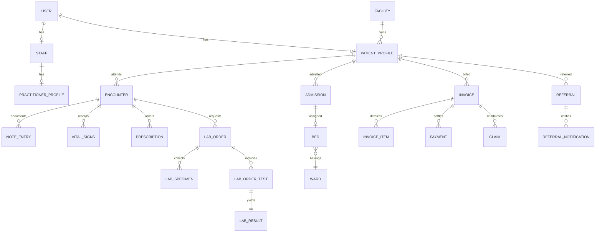

# HMS Backend Deep Dive

This document describes the implemented backend architecture in `/Users/jebre/Desktop/hms/backend`.

It is based on source inspection of current code, not intended architecture alone.

## 1. Runtime Stack

Core runtime components:

- Django 4.2 + DRF
- Channels + Daphne (HTTP + WebSocket)
- Celery + Redis
- PostgreSQL
- Google FHIR integration client

Key files:

- `/Users/jebre/Desktop/hms/backend/hms_backend/settings.py`
- `/Users/jebre/Desktop/hms/backend/hms_backend/urls.py`
- `/Users/jebre/Desktop/hms/backend/hms_backend/asgi.py`
- `/Users/jebre/Desktop/hms/backend/hms_backend/celery.py`

## 2. Process Model

### 2.1 HTTP + WebSocket process

`/backend/hms_backend/asgi.py` uses a `ProtocolTypeRouter`:

- HTTP: standard Django ASGI app
- WebSocket: `AllowedHostsOriginValidator` + `JWTAuthMiddleware` + URLRouter

### 2.2 Worker process

`/backend/hms_backend/celery.py` autoloads tasks from installed apps.

### 2.3 Startup and migration safety

Deployment entry path:

- `/backend/startup_and_run.py`

Features:

- DB readiness waiting
- optional migrate-on-start mode
- strict pending migration gate (`FAIL_ON_PENDING_MIGRATIONS`)
- advisory lock around migrations

Dedicated migrator:

- `/backend/run_migrations.py`

## 3. Django Configuration and Middleware Pipeline

### 3.1 Installed app shape

Installed apps include all major clinical and operational domains:

- core, users, patients, encounters, clinical_notes, nursing, laboratory, pharmacy
- appointments, wards, organization, workflows, dashboards, notifications
- billing, inventory, drug_safety, referrals, audit
- consent, mpi, interop

### 3.2 Middleware order and backend request semantics

Middleware order is important for security behavior:

1. `corsheaders.middleware.CorsMiddleware`
2. `django.middleware.security.SecurityMiddleware`
3. `whitenoise.middleware.WhiteNoiseMiddleware`
4. `django.middleware.gzip.GZipMiddleware`
5. `django.contrib.sessions.middleware.SessionMiddleware`
6. `django.middleware.common.CommonMiddleware`
7. `django.middleware.csrf.CsrfViewMiddleware`
8. `hms_backend.middleware.FacilityContextMiddleware`
9. `django.contrib.auth.middleware.AuthenticationMiddleware`
10. `hms_backend.middleware.JWTUserTypeValidationMiddleware`
11. `hms_backend.middleware.OffSiteDetectionMiddleware`
12. `apps.audit.middleware.AuditMiddleware`
13. `django.contrib.messages.middleware.MessageMiddleware`
14. `django.middleware.clickjacking.XFrameOptionsMiddleware`
15. `hms_backend.middleware.RequestLoggingMiddleware`

Key implications:

- Facility context is resolved before authorization-sensitive app logic.
- JWT claim/user_type mismatch is blocked centrally.
- Offsite read-only mode can deny mutating methods.
- Request logging scrubs path IDs before logging.

## 4. Authentication and Session Model

Key auth views:

- `/api/auth/login/`
- `/api/auth/token/refresh/`
- `/api/auth/logout/`
- MFA endpoints under `/api/auth/mfa/*`
- password reset endpoints under `/api/auth/password-reset/*`

Auth mechanics:

- Access token: short-lived JWT (15 minutes).
- Refresh token: HttpOnly cookie, rotated and blacklisted.
- Login includes facility resolution and MFA flow handling.

Security controls present in code:

- Login throttle (`LoginRateThrottle` in `auth_views.py`).
- JWT user_type validation middleware.
- MFA required flags in settings.

## 5. Facility/Tenancy and Access Control

### 5.1 Facility context resolution

Facility resolution is centralized in `FacilityContextMiddleware` and `apps/core/security.py`.

Resolution order effectively includes:

- facility header
- JWT claim
- single allowed user facility
- default facility

### 5.2 Object/query scoping

`apps/core/security.py` provides:

- `FacilityScopedQuerysetMixin`
- `FacilityScopedPermission`
- object-to-facility resolution utilities
- role/team/break-glass helpers for clinical access checks

### 5.3 Tenancy context propagation

`hms_backend/tenancy.py` uses `contextvars`:

- request/task-scoped facility code
- helpers for cache key prefixes
- decorator/context manager for facility-aware tasks

## 6. API Surface Inventory

Global URL router root:

- `/Users/jebre/Desktop/hms/backend/hms_backend/urls.py`

### 6.1 Prefix-to-domain map

- `/api/health/` -> health check
- `/api/auth/*` -> login/logout/refresh/MFA/password reset
- `/api/users/*` -> user, staff, practitioner, patient profile management
- `/api/patients/*` -> patient mappings/search/notes/profile-facing operations
- `/api/appointments/*` -> schedule, appointment, slot, recurring scheduling
- `/api/wards/*` -> ward/bed/admission/transfer primitives
- `/api/encounters/*` -> encounter lifecycle + visits + triage
- `/api/clinical-notes/*` -> templates, entries, prescriptions, timeline
- `/api/nursing/*` -> vitals/tasks/alerts/MAR/handoff/treatment/fluid balance
- `/api/pharmacy/*` -> dispensing + supply queue
- `/api/laboratory/*` -> tests/panels/orders/specimens/results
- `/api/referrals/*` -> referral lifecycle + SLA + waitlist
- `/api/drug-safety/*` -> allergies, interaction checks, safety alerts
- `/api/billing/*` -> invoices/payments/claims/NHIS/cash/PSP
- `/api/inventory/*` -> stock, procurement, transfers, controlled substances
- `/api/organization/*` -> clinical unit hierarchy, clinics, staffing, roster
- `/api/consent/*` -> cross-facility consent control plane
- `/api/interop/*` -> export jobs for cross-facility record delivery
- `/api/notifications/*` -> denormalized inbox API
- `/api/workflows/*` etc -> workflow engines/templates
- `/api/dashboards/*` -> role-specific dashboard projections
- `/api/admin/*` -> audit log APIs
- `/api/facilities/*`, `/api/search/omni/`, settings endpoints via core

## 7. Domain Model Topology

The backend is domain-first with strongly connected clinical entities.



### 7.1 Foundational identity/access models

- `users.User` (custom auth principal, facility associations, user_type)
- `users.Staff`, `users.PractitionerProfile`
- `users.PatientProfile` (MRN, facility-bound patient record)
- `core.Facility`, `core.Department`, network/offsite/idempotency/break-glass models

### 7.2 Encounter-centered clinical core

- `encounters.Encounter` is local-first and can sync to FHIR asynchronously.
- `encounters.OutpatientVisit`, `encounters.TriageQueue`, `encounters.EncounterCareTeam` extend encounter lifecycle.
- `wards.Admission` links patient/bed/facility and carries status transition validation.

### 7.3 Documentation and longitudinal data

- `clinical_notes.NoteTemplate`, `NoteEntry`, `NoteEntryVersion`
- `clinical_notes.Prescription`
- `clinical_notes.TimelineEvent` for denormalized timeline pagination

### 7.4 Nursing operations

- `nursing.VitalSigns`, `NursingTask`, `NursingAlert`, `MedicationAdministration`
- `nursing.ShiftHandoff`, `TreatmentSheetEntry`, `SupplyRequest`, `FluidBalance`

### 7.5 Diagnostics and orders

- `laboratory.LabTestCatalog`, `LabPanel`
- `laboratory.LabOrder`, `LabOrderTest`, `LabSpecimen`, `LabResult`
- per-day sequence strategy for order numbers (`LabOrderSequence`) avoids hot-path scans

### 7.6 Referrals and care coordination

- `referrals.Referral`
- `referrals.ReferralNotification`, SLA policy/event models
- `referrals.ClinicWaitlistEntry`

### 7.7 Billing and payments

Core entities:

- service catalog: `ServiceCategory`, `Service`
- payer setup: `InsuranceProvider`, `InsurancePlan`, `PatientInsurance`
- revenue: `Invoice`, `InvoiceItem`, `Payment`, `Receipt`
- claims/remittance: `Claim`, `NHISClaimBatch`, remittance/import models
- PSP integration: `PaymentIntent`, webhook event capture

### 7.8 Organization model (hierarchical)

`organization.ClinicalUnit` is an MPTT hierarchy with denormalized root/path caches.

Supports:

- clinic and clinic schedule assignment
- leadership and staff assignments
- cross coverage
- duty roster and validation rules

### 7.9 Control-plane interoperability

- `mpi.PatientIdentity`, `PatientFacilityLink`
- `consent.ConsentGrant`, access tokens, cross-facility referrals
- `interop.RecordExportJob` for encrypted export packages

## 8. Query and Serialization Patterns

Patterns implemented in core utilities:

- list/detail serializer switching (`ListDetailSerializerMixin`)
- action-specific serializer mapping (`ActionSerializerMixin`)
- action-specific queryset optimization (`OptimizedQuerysetMixin`)
- facility-scoped create/queryset mixins

Shared paginations:

- `StandardResultsSetPagination` (page_size 100)
- `SmallResultsSetPagination`
- `LargeResultsSetPagination`

## 9. Asynchronous Work and Scheduled Tasks

### 9.1 App-level task modules

Task modules exist in:

- appointments, audit, billing, dashboards, encounters, interop
- laboratory, notifications, organization, patients, referrals, users, wards

### 9.2 Examples of async domains

- FHIR sync and search tasks (patients/encounters/users)
- notifications fanout tasks
- referral SLA and reminders
- export bundle creation
- dashboard cache refresh

### 9.3 Beat schedule (from settings)

Configured periodic jobs include:

- weekly slot generation
- daily cleanup of password tokens
- daily cleanup of user sessions
- admin dashboard refresh every 60 seconds

## 10. Realtime Layer (Channels)

### 10.1 WS routes

Defined in `/backend/hms_backend/routing.py`:

- `/ws/alerts/`
- `/ws/alerts/ward/<ward_id>/`
- `/ws/vitals/<patient_id>/`
- `/ws/notifications/`
- `/ws/dashboards/admin/`
- `/ws/dashboards/my-work/`
- `/ws/dashboards/clinic/`
- `/ws/dashboards/nurse/`
- `/ws/dashboards/inpatient/`
- `/ws/dashboards/reception/`

### 10.2 WS auth

`hms_backend/websocket_auth.py` supports:

- preferred JWT via websocket subprotocols (`hms.jwt`, `<token>`)
- fallback token query parameter
- claim validation and user resolution
- facility code extraction into ASGI scope

### 10.3 Consumer security shape

Consumers enforce, depending on channel:

- authentication
- role eligibility
- facility scope checks
- patient/ward authorization checks

## 11. External Integrations

### 11.1 FHIR client

`apps/fhir_client/client.py` provides:

- request helpers (`create/get/update/delete/search`)
- retry logic
- circuit breaker around external calls
- mock mode when credentials are unavailable

### 11.2 PSP integration

Billing includes provider-agnostic intent model + webhook handling.

### 11.3 Email

Configurable REST email backend supports Unosend and Resend via `EMAIL_PROVIDER`.

## 12. Testing and Quality Gates

### 12.1 Backend test config

`/backend/pytest.ini` defines:

- `DJANGO_SETTINGS_MODULE = hms_backend.settings_test`
- DB reuse (`--reuse-db`) and explicit DB access through `db` / `@pytest.mark.django_db`
- marker taxonomy (`tier1/tier2/tier3`, `rbac`, `integration`, etc.)

`/backend/hms_backend/settings_test.py` keeps the default test path cheap and deterministic:

- locmem cache instead of Redis
- in-memory email backend
- eager Celery with propagated exceptions
- MD5 password hashing
- safe test defaults for required env vars

The global autouse DB fixture has been removed. Pure unit tests should not touch the database. Tests that need the database must request `db`, use `@pytest.mark.django_db`, or depend on a DB-backed fixture.

When a reused local test database is stale after migration or seed-data changes, rebuild it once:

```bash
pytest -n auto --create-db
```

### 12.2 Coverage and CI

CI workflow executes:

- flake8
- migration preflight
- fast parallel backend pytest on push/PR
- backend coverage on the scheduled/manual coverage job
- docker build parity checks

## 13. Deployment and Infra Notes

- Backend Docker image is multi-stage (`/backend/Dockerfile`).
- Startup uses ASGI (Daphne) for both HTTP and WebSockets.
- Hetzner client VPS deployments run via `ops/hetzner-client-vps/compose.yml`.

## 14. High-Risk Complexity Zones (Current State)

Largest backend modules by size include:

- `billing/models.py`, `billing/views.py`
- `inventory/models.py`, `inventory/views.py`
- `clinical_notes/views.py`
- `nursing/views.py`
- `organization/views.py`

When changing these areas, prioritize:

- query count checks
- serializer payload control
- strict permission review
- scoped regression tests

## 15. Practical Extension Guide

### 15.1 Adding a new facility-scoped API resource

1. model: include explicit `facility` relation where applicable
2. viewset: apply facility-scoping patterns (`core.security`/mixins)
3. serializer: provide list serializer variant for list action
4. URL: register under app `urls.py`
5. tests: access control + list/detail + query behavior

### 15.2 Adding new realtime event

1. define consumer group naming strategy
2. enforce auth + scope checks before group join
3. emit PHI-minimized invalidation payloads
4. drive full data fetch via HTTPS API

### 15.3 Adding external integration call

1. keep request thread non-blocking when possible (Celery)
2. add retry strategy and failure observability
3. avoid storing sensitive payloads in plaintext logs
4. include idempotency strategy for callbacks/webhooks

## 16. File Index (High-Value Read Order)

1. `/Users/jebre/Desktop/hms/backend/hms_backend/settings.py`
2. `/Users/jebre/Desktop/hms/backend/hms_backend/urls.py`
3. `/Users/jebre/Desktop/hms/backend/apps/core/security.py`
4. `/Users/jebre/Desktop/hms/backend/hms_backend/middleware.py`
5. `/Users/jebre/Desktop/hms/backend/apps/encounters/models.py`
6. `/Users/jebre/Desktop/hms/backend/apps/clinical_notes/models.py`
7. `/Users/jebre/Desktop/hms/backend/apps/nursing/models.py`
8. `/Users/jebre/Desktop/hms/backend/apps/laboratory/models.py`
9. `/Users/jebre/Desktop/hms/backend/apps/billing/models.py`
10. `/Users/jebre/Desktop/hms/backend/apps/organization/models.py`
11. `/Users/jebre/Desktop/hms/backend/apps/workflows/models.py`
12. `/Users/jebre/Desktop/hms/backend/hms_backend/routing.py`
13. `/Users/jebre/Desktop/hms/backend/hms_backend/websocket_auth.py`
14. `/Users/jebre/Desktop/hms/backend/apps/fhir_client/client.py`
